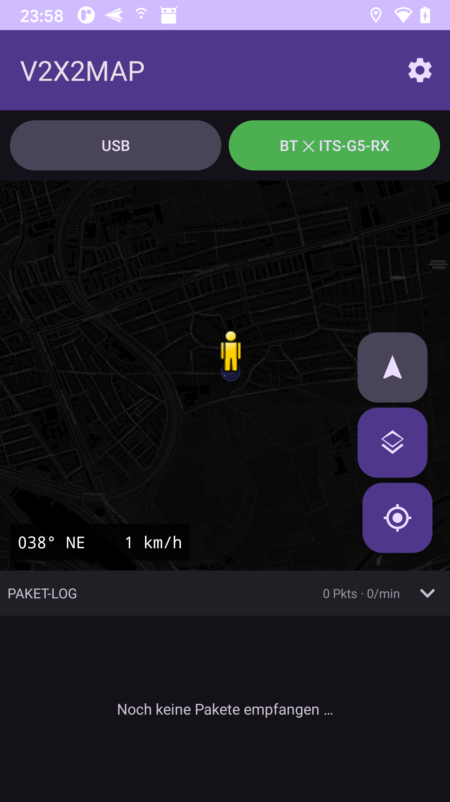
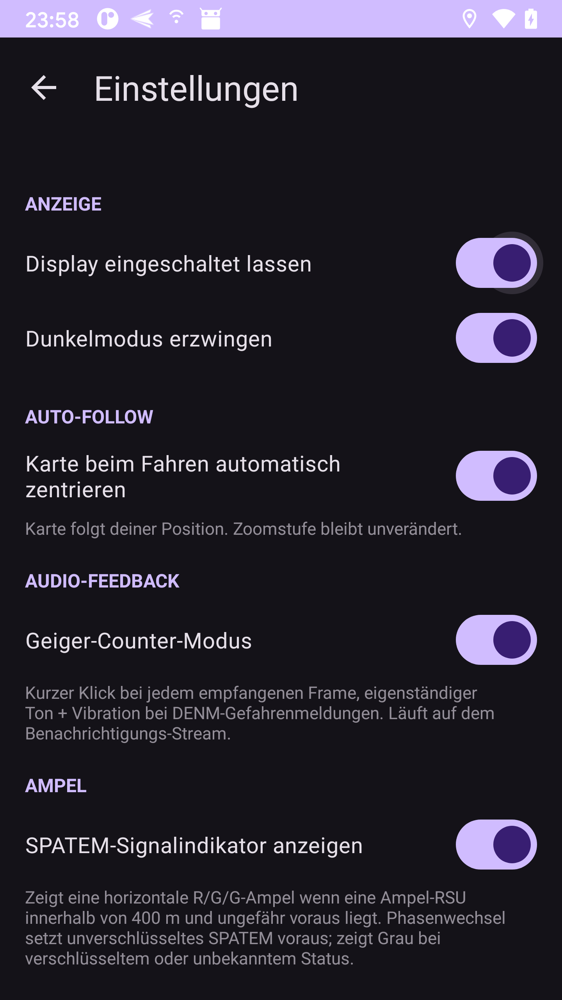
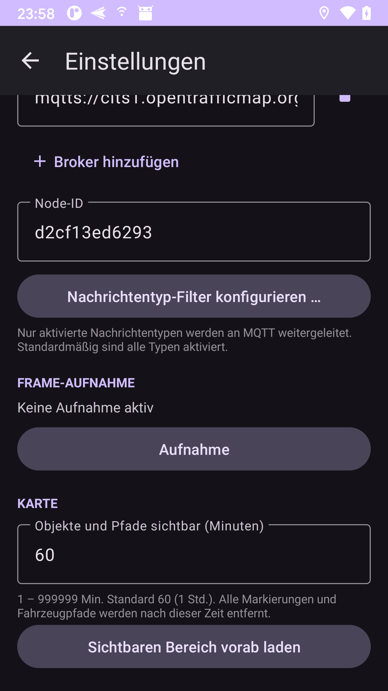
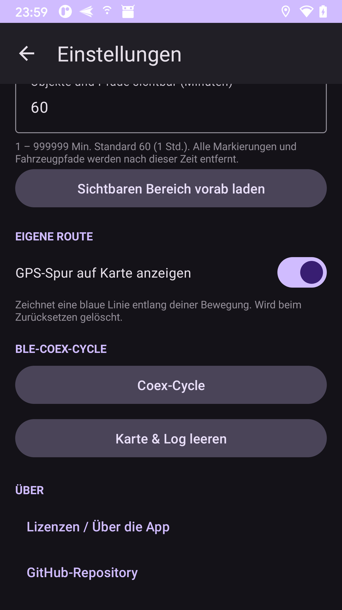

**V2X2MAP** is an open-source receiver and live map for **ITS-G5 / V2X** traffic — the 5.9 GHz IEEE 802.11p messages cars and roadside infrastructure send to coordinate.

Plug a $20 ESP32-C5 dev board into your phone, drive somewhere with modern infrastructure, watch the CAMs, DENMs and SPATEMs roll in.


<table>
<tr>
<td></td>
<td></td>
<td></td>
<td></td>
</tr>
</table>

---

## What's new in 0.3.0

### 🚗 Drive Mode *(experimental — feedback welcome!)*

A full-screen animated HUD that replaces the map while you're on the road. Tap the car icon FAB to activate.

- Perspective road view animates at your real GPS speed
- **Traffic light card** appears automatically when a signalised intersection is within 300–400 m ahead — shows live phase (R/Y/G), countdown in seconds and distance
- **Nearby vehicle indicators** drawn in the road perspective: amber silhouette for vehicles ahead, red with headlight glow for oncoming traffic, badge for close-following vehicles
- **Hazard banner** when a DENM event is detected within 500 m in your direction of travel
- OTM Live Feed activates automatically when Drive Mode is switched on

> **Drive Mode is an early-stage prototype.** The traffic-light detection, vehicle radar and road visuals are functional but not yet fully polished. If you test it in the field, please open an issue or send feedback — every report helps shape the next iteration. Pull requests are very welcome.

---

### 📡 OTM Live Feed

Stream live V2X data from [opentrafficmap.org](https://opentrafficmap.org) directly onto the map — no hardware required.

- Connects to `wss://opentrafficmap.org/ws_ext` via WebSocket with automatic gzip decompression and reconnect
- Shows vehicles, RSUs, trams, buses, cyclists, pedestrians and traffic lights from the OTM network worldwide
- **Visually distinct:** OTM markers use an amber colour scheme so they are immediately distinguishable from your own locally received ITS-G5 frames
- Toggle with the RSS icon FAB; activates automatically in Drive Mode
- Parses `delta`, `snapshot` and `traffic-light-map-batch` (MAPEM) messages

---

### 📤 PCAP Upload

Replay recorded `.pcap` files to any configured MQTT broker — even offline, without the ESP32-C5 hardware.

- Tap the upload icon ↑ in the main toolbar
- File list sorted newest-first with date and file size
- Live progress card with cancel button
- Reuses the broker addresses and node-ID you already configured in Settings
- Mirrors the workflow of the included `pcap-replay.py` Python script

---

### 🎨 UI Overhaul

- Settings screen: every section now sits inside a **Material 3 filled card** — much cleaner visual hierarchy
- Speed overlay and SPAT traffic-light pill now use **rounded backgrounds** instead of hard-coded flat rectangles
- Controls bar has a subtle elevated surface so it clearly separates from the map
- Log header improved with letter-spacing and monospace stats

---

### 🛠 DevOps — Demo Mode

Hidden in **About → DevOps**: generate realistic simulated ITS-G5 frames within the current map viewport.

- 7 vehicles moving naturally at up to 58 km/h, 2 SPATEM RSUs cycling through all phases
- Frames are structurally valid 802.11p/GeoNetworking/BTP-B payloads that `ItsG5Decoder` fully decodes
- Goes through the identical `handleFrames()` pipeline — recording, MQTT forwarding, frame log and Geiger counter all work on demo data

---

## Acknowledgements

Big thanks to the team behind [**opentrafficmap/its-g5-receiver-firmware**](https://codeberg.org/opentrafficmap/its-g5-receiver-firmware) on Codeberg — without their foundational work this project would not exist. V2X2MAP is a fork of their firmware adapted for the Waveshare ESP32-C5-WIFI6-KIT devboard, extended with BLE streaming, the Android app, and the Windows installer.

---

## What it is

Modern cars and roadside units (RSUs) broadcast standardised safety messages on the dedicated 5.9 GHz V2X band:

- **CAM** — Cooperative Awareness: "I'm here, going X km/h"
- **DENM** — Decentralised Environmental Notification: "hazard ahead!"
- **SPATEM** — Signal Phase + Timing: traffic-light countdown
- **MAPEM** — intersection geometry

V2X2MAP captures these in promiscuous mode, decodes the GeoNetworking headers locally, and plots each message as a colour-coded marker on an OSM map. No cloud round-trip required — everything runs on the phone.

---

## Hardware

One **Waveshare ESP32-C5-WIFI6-KIT** dev board and any Android phone with USB-OTG or Bluetooth LE.

The board supports 5.9 GHz IEEE 802.11p out of the box; the firmware drives it as a sniffer and forwards captured frames to your phone.


- **Amazon with external Antenna:** [Waveshare ESP32-C5-WROOM-1 dev board](https://amzn.to/4uDpwNa) *
- **Amazon without external Antenna:** [Waveshare ESP32-C5-WROOM-1 dev board](https://amzn.to/43qIJ9h) *
- **AliExpress:** [Waveshare Official Store](https://s.click.aliexpress.com/e/_c3pGqqLN) *

---

## Features

| Feature | Description |
|---|---|
| **Live map** | 5 switchable tile layers: Standard, Dark, Satellite, ÖPNV, Humanitarian |
| **OTM Live Feed** | Real-time V2X data from opentrafficmap.org overlaid in amber — no hardware needed |
| **Drive Mode** *(beta)* | Animated HUD with traffic-light card, vehicle radar and DENM banner |
| **PCAP Upload** | Replay recorded `.pcap` files to MQTT — offline, without hardware |
| **Demo Mode** | Realistic simulated ITS-G5 frames for testing all app features |
| **Grouped frame log** | One row per station (MAC); expandable to last 20 frames; type icon, speed, distance, 🔒/🔓 |
| **CAM markers** | One marker per vehicle, updated in-place with baked-in heading + speed label |
| **Compass mode** | Bearing-up FAB rotates the map to keep your heading at the top |
| **Own GPS track** | Optional blue polyline traces your route |
| **Auto-follow** | Map pans with you; zoom stays exactly as you set it |
| **Geiger-counter mode** | Audio + haptic tick on every frame, distinct beep + buzz on DENM hazard |
| **BLE + USB auto-reconnect** | Exponential-backoff reconnect on cable pull or BT drop — no user interaction |
| **Offline maps** | OSMdroid tile cache up to 600 MB |
| **PCAP recording** | One tap records to standard `.pcap`; open directly in Wireshark (link type 105 = IEEE 802.11) |
| **Multi-broker MQTT** | One input field per broker, add/remove with + / 🗑; per-type message filter |

---

## Architecture

```
+---------------+     5.9 GHz 802.11p      +------------+
|  Vehicles &   |   CAM / DENM / SPATEM    |  ESP32-C5  |
|  RSUs         |  ----------------------> |  sniffer   |
+---------------+                          +-----+------+
                                                 |
                                  USB-Serial-JTAG | BLE-GATT
                                                 v
                                        +--------+--------+
                                        | Android app /   |
                                        | Python bridge   |
                                        +--------+--------+
                                                 |
                                    MQTT (optional)  |  OTM WebSocket
                                                 v         v
                                  cits1.opentrafficmap.org / your own broker
```

---

## Install

### Windows — one-click installer (easiest)

1. Download **ITS-G5 Receiver Setup** from the [Releases page](../../releases/latest)
2. Connect the ESP32-C5 via USB
3. Run the EXE and follow three steps:

<table>
<tr>
<td align="center"><strong>Step 1 — Select COM port</strong></td>
<td align="center"><strong>Step 2 — Flash firmware</strong></td>
<td align="center"><strong>Step 3 — Set Node-ID</strong></td>
</tr>
<tr>
<td></td>
<td></td>
<td></td>
</tr>
<tr>
<td>The installer detects the board automatically. Pick the right port and click <em>Weiter</em>.</td>
<td>The installer writes bootloader, partition table and application to the C5. Takes 30–60 seconds.</td>
<td>The installer reads the MAC from the chip and pre-fills the Node-ID. Hit <em>Fertig – Bridge starten</em>.</td>
</tr>
</table>

---

### Manual build from source

<details>
<summary>Firmware (ESP-IDF)</summary>

```powershell
# once per shell — activate ESP-IDF toolchain
. .\esp-idf\export.ps1

cd V2X2MAP\firmware
idf.py build
idf.py -p COMx -b 921600 flash
```

</details>

<details>
<summary>Android app</summary>

```powershell
cd V2X2MAP\android
.\gradlew.bat assembleDebug
adb install -r app\build\outputs\apk\debug\app-debug.apk
```

Or open `V2X2MAP/android/` in Android Studio. Min SDK 24 (Android 7.0).

</details>

<details>
<summary>Python bridge + dashboard</summary>

```powershell
cd V2X2MAP\bridge
python its_g5_bridge.py --port COMx --node-id <mac-without-colons>
```

Dashboard at `http://127.0.0.1:8080`. Default MQTT broker: `mqtts://cits1.opentrafficmap.org:8883`.

</details>

---

## Changelog

### 0.3.0
- Drive Mode (experimental HUD with traffic lights, vehicle radar, DENM banner)
- OTM Live Feed via WebSocket (real-time data from opentrafficmap.org)
- PCAP Upload to MQTT without hardware
- Demo Mode for offline testing
- Material 3 card-based Settings UI
- Gradle upgraded to 8.9 (Java 21 compatibility)
- Added OkHttp dependency for WebSocket support

### 0.2.3
- Initial public release

---

## Legal

Receiving and forwarding ITS-G5 radio data may be subject to national telecommunications law and data-protection law. The Android app shows a disclaimer on first launch. Use at your own risk.

Code is published under the **MIT License** — see [`LICENSE`](LICENSE).

\* affiliate link (no extra cost for you)
